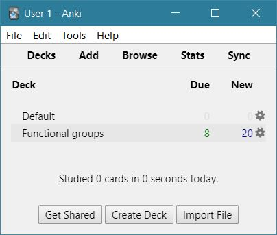
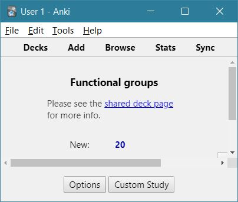
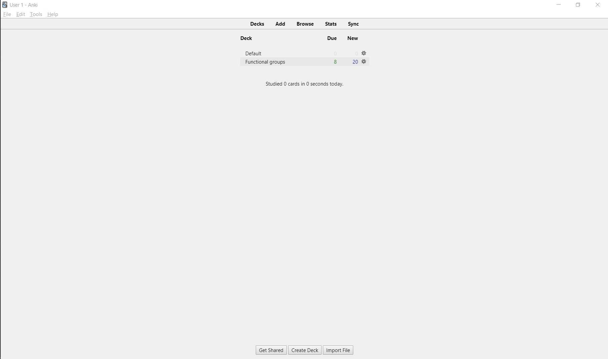
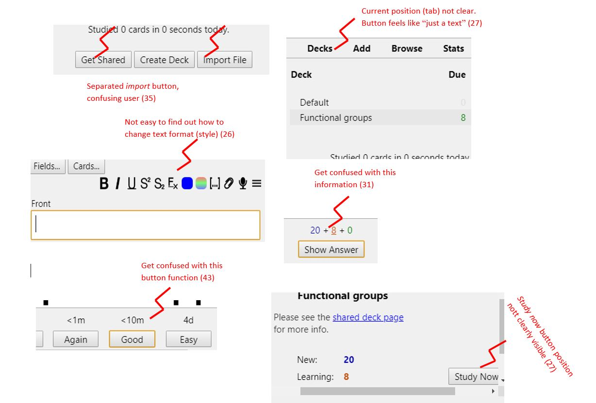
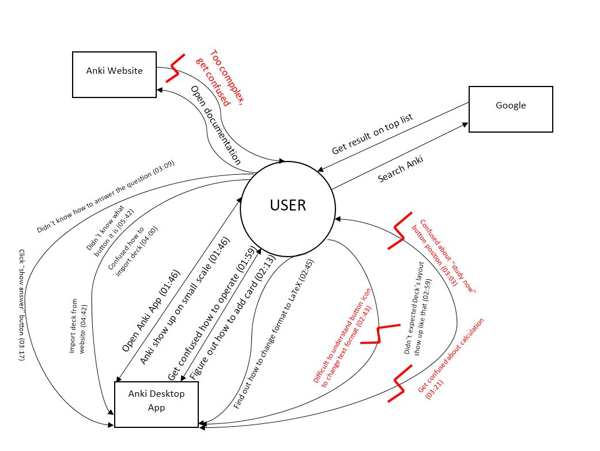
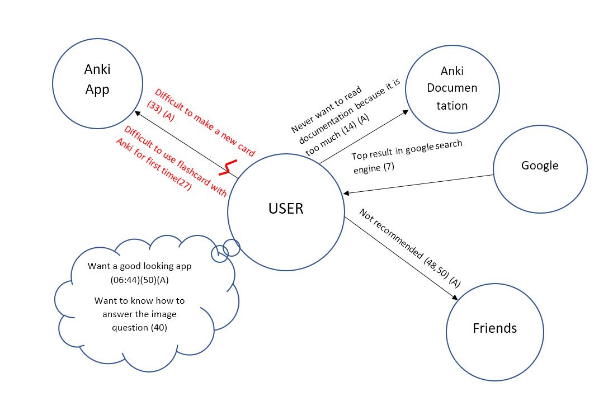

# Contextual Inquiry and Analysis

## Contents

* [Description of Anki](#Anki-Description)
* [Instruction Script](#Instruction-Script)
* [User Description](#User-Description)
* [Transcript](#Transcript)
* [Artifact Model](#Artifact-Model)
* [Flow Model](#Flow-Model)
* [Cultural Model](#Cultural-Model)
* [Do's and Don't's](#Do's-and-Don't's)

## Anki Description

Anki is an application to help remembering things with flashcard. It is widely distributed to different platform from Desktop Apps (Windows, Linux, Mac) to Mobile Apps (Android and iOS). It is content-agnostice, it means that we can create card with images, videos, audio, and scientific markup with _LaTeX_ based. This application is also _open source_, means that anyone can contribute to development of Anki. The cards are presented using HTML and may include text, images, sounds, videos, and LaTeX equations. The decks of cards, along with the user's statistics, are stored in the open SQLite format.

### Anki's Dasboard



### Anki's Deck



### Anki's Fullscreen Window



## Instruction Script

___

1. Find out what is flashcard and Anki
2. Find out documentation of Anki
3. Open Anki and figure it out
4. Try to explore Anki
5. Try to create deck and card
6. Find out how to change text format style
7. Try to use it
8. Find out what user feel about Anki for using it first time
9. Try to import deck from other user (from community website)

## User Description

___

* Male, 20 years old
* He is Informatics student
* He has experiences using computer and always work with it
* Know what flashcard is
* But he doesn't familiar with flashcard application
* He never use flashcard as study method
* Not a person who takes a time to read documentation

## Transcript

___

```text
1. Me: Kamu tau ga sih flashcard itu apa?
2. User: Tau, jadi flashcard itu ada isinya buat inget sesuatu jadi setiap orang bisa inget suatu hal
3. Me: Berarti tau dong flashcard itu apa?
4. Me: Nah ada aplikasi yang buat desktop juga bisa dan mobile juga bisa seperti Android dan iOS
5. User: Wah apa tuh?
6. Me: Namanya Anki, kalo kamu gatau Anki bisa cari di google
7. (Mencari Anki di google)
8. Me: Jadi Anki ini benar-benar bisa buat flashcard sendiri
9. Me: Nah, kamu pernah ga sih belajar pakai flashcard sebelumnya?
10. User: Enggak.
11. Me: Misalkan kamu pakai flashcard kamu mau coba Anki ga?
12. User: Enggak tau belum pernah
13. Me: Nah, dari dokumentasi ini ada yang kamu bingung ga?
14. User: Gatau enggak pernah baca dokumentasi
15. Me: Oh yaudah coba diaplikasinya aja
16. (Membuka aplikasi Anki)
17. Me: Jadi ini aplikasinya. Tampilannya seperti ini. Coba explore deh
18. User: (maximize window Anki) Wah bisa gede
19. User: Oh jadi ini buat nambah (02:13)
20. Me: Iya, jadi kalo kamu mau buat card, ini bagian front nya. Front-nya tuh seperti... (02:14)
21. User: Kata? (Pertanyaan) (02:27)
22. Me: Nah belakangnya itu jawabannya, biasanya seperti itu. (02:26)
23. Me: Dan juga ini bisa LaTeX (02:34)
24. User: Wow (02:36)
25. Me: Jadi LaTeX kayak kamu bisa buat formula matematika (02:42)
26. User: Mana formulanya? Ini? Oh bukan. Enggak ah (bingung), oh itu disitu. Wah. Gak ngerti. (02:43)
27. User: Mana deck-nya? Udah ini doang? Oh study now, hehe (02:58)
28. User: Trus jawabnya dimana? Gabisa jawab gitu? (03:07)
29. Me: Jadi jawabnya tuh kayak kamu ngira-ngira gitu (03:11)
30. User: Oh. Yaudah-yaudah hehe kirain (03:15)
31. User: (Bingung dengan opsi again). Hah, nol tambah nol tambah dua? (03:19)
32. Me: Terus diluar dokumentasi ini, ada ga kesulitan apa? Misalkan dalam membuat card atau deck (03:31)
33. User: Gak nggak jelas sih (03:48)
34. Me: Sebenarnya bisa sih kamu import dari user lain? (03:53)
35. User: Hah ini Get Shared atau import? (bingung) (03:59)
36. Me: Coba saja (04:03)
37. User: Oh dari sini (04:11)
38. Me: Nah kamu bisa milih topik apa aja. Bisa kamu cari deh (04:13)
39. User: Oh tinggal klik aja ya. Mana? Kok ga keluar. Oh ini (04:39)
40. User: Wah gimana dong, harus digambar? Gabisa digambar Hehe (05:10)
41. Me: Bukan digambar tapi kamu mengira-ngira (05:14)
42. User: Wow, bisa di langsung edit juga (05:19)
43. User: Oh iya apa bedanya, beda good apa nih? Kenapa good? Kenapa ada good-nya? (bingung) (05:41)
44. Me: Bingung? (05:49)
45. User: Bingunglah (05:50)
46. (Mencoba memahami tombol dibawah card)
47. Me: Nah kan kamu tadi udah buat deck-card, rasanya gimana? Maksudnya pengalaman kamu menggunakan Anki sebagai aplikasi flashcard untuk belajar kamu gimana?  (06:05)
48. User: Rasanya misterius (06:29)
49. Me: Kalo untuk tampilannya? (06:42)
50. User: Tampilannya lebih misterius (06:44)
51. Me: Menurut kamu, opini kamu tentang ini untuk mau menggunakan Anki apa? (06:53)
52. User: Mungkin disamain desainnya lebih diperbagus dan dikurangi beberapa elemen-elemen yang ga perlu(07:04)
53. (Menunjukkan halaman deck)
54. User: Terus didepannya ini cuma perlu deck terus tambah aja (Add) (07:14)
55. User: (Menunjukkan tab)
56. User: Nah terus ditambah itu bisa tambahin get shared sama import file atau apa, sisanya sih ga terlalu penting (07:18)
57. Me: Hmm gitu ya. Ok, makasih
58. User: Ok, sama-sama
```

## Models and Annotations

___

### Artifact Model



### Flow Model



### Cultural Model



## Do's and Don't's

___

### Do

* Include helpful application guide (like a popup after click on button) when application is first opened
* Responsive layout when window is on maximum scale or minimum scale, so its button didn't overflow.
* Change tab button (Deck, Card, Browse, Stats) to be more good looking button, not just a button with clickable text design
* Give more clear information about buttons functionality on _study now_ layout
* Give more understandable information about cards statistic
* Make an easier way to change style of card (change format, design, etc.)

### Don't

* Use fixed size window, because when user maximize window, it give a static layout (like a minimum scale window but with bigger scale)
* Make complex documentation because unexperience user feels to complicated and don't want to read it
* Combine _Create Deck_ button with _Add_ button (on same fields)

# Remarks
> * Overall this report are pretty well written. All the parts are complete, except for just one breakdown in `Flow Model` missed its line-number(s) referring to the problems recorded in the `Transcript`.

| Working Days | Commits before D | Commits after D | Presentation (80%) | Repo (20%) | Total |
|:------------:|:----------------:|:---------------:|:------------------:|:----------:|:-----:|
| 2            | 5                | 0               | 90,5               | 82         | 88,8  |
